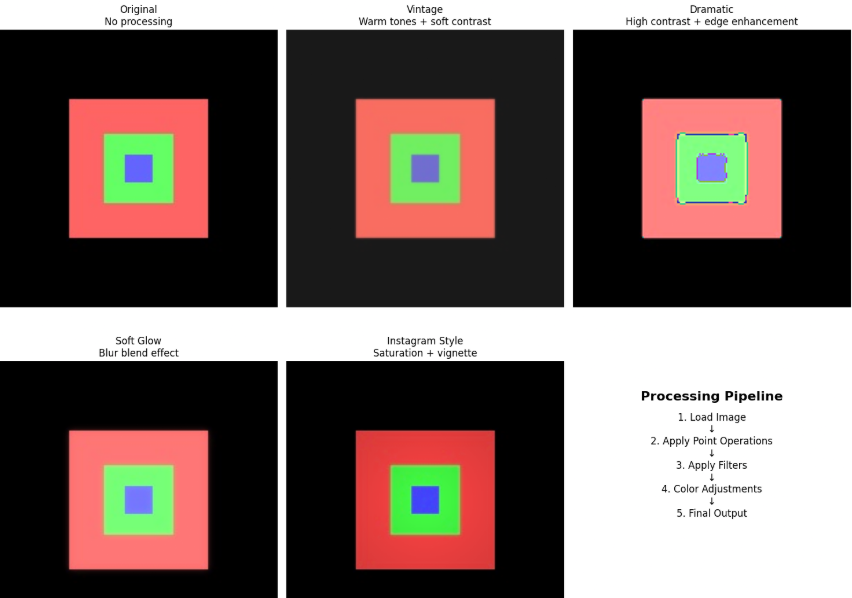
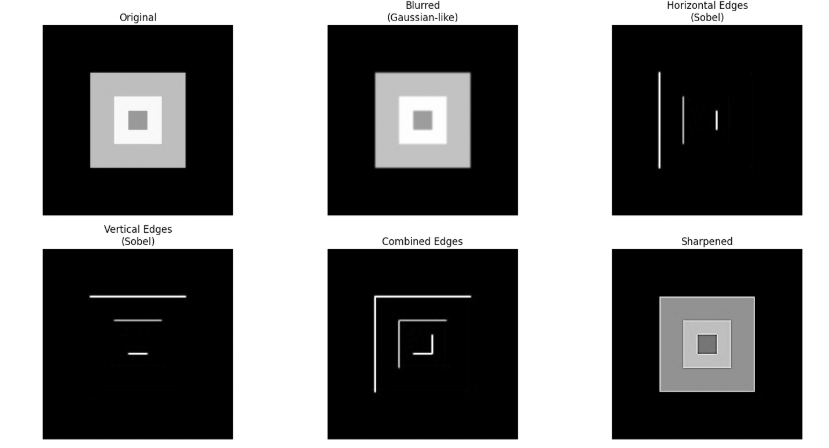
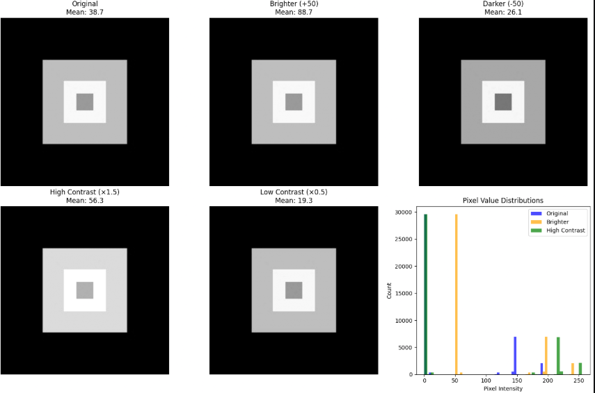
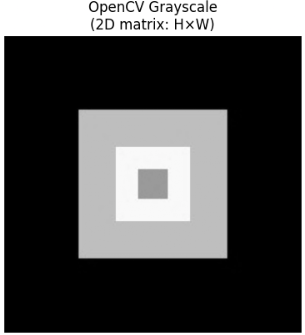

# Lab 02 – Digital Image Processing

## Problem Statement

The purpose of this lab was to understand how computers represent and process digital images. The lab explored how changing pixel values can affect the appearance of an image.

The main goal was to apply basic image-processing operations such as grayscale conversion, brightness adjustment, contrast adjustment, filtering, and edge detection.

## Approach

I loaded a color image and examined how it was represented using red, green, and blue pixel values.

I then applied several image-processing techniques:

- Converted the RGB image to grayscale
- Increased and decreased brightness
- Adjusted image contrast
- Applied blur and sharpening filters
- Used edge detection to locate areas where pixel values changed quickly
- Compared the original image with the processed versions

The results were displayed using Matplotlib.

## Dataset

This lab did not use a large dataset. It used sample images for image-processing experiments.

The images were loaded in the notebook and processed directly using Python libraries. No public dataset was uploaded to this repository.

## Results

The grayscale conversion removed the color information while keeping the shapes and brightness levels of the image.

Changing the brightness made the image lighter or darker by modifying pixel values. Contrast adjustment changed the difference between the light and dark areas.

The blur filter reduced image details, while the sharpening filter made edges and features more visible. Edge detection identified areas where the pixel values changed quickly.

This lab did not train a machine-learning model, so there were no accuracy, precision, recall, or loss metrics.

## Key Findings

I learned that digital images are made of numerical pixel values.

Changing these values can change the brightness, contrast, color, and details of an image. I also learned that image filters use mathematical operations to create visual effects such as blur, sharpening, and edge detection.

These image-processing techniques can be used as preprocessing steps before an image is given to a computer-vision model.

## Technologies and Dependencies

This lab used:

- Python
- NumPy
- Pillow
- Matplotlib
- OpenCV
- Google Colab
- Jupyter Notebook

## How to Run

1. Open the `.ipynb` notebook in this folder using Google Colab or Jupyter Notebook.
2. Run the cells from top to bottom.
3. Make sure the required image files are available to the notebook.
4. View the processed images and comparisons in the output cells.

## Sample Results

### Original RGB Image

This image shows the original color image before processing.

### Grayscale Conversion

This result shows the image after its color information was removed.

### Brightness and Contrast Comparison

This comparison shows how changing pixel values affects image brightness and contrast.

### Filters and Edge Detection

This image shows the results of blur, sharpening, and edge-detection filters.

### Image-Processing Effects

This comparison summarizes several image-processing operations completed during the lab.## Sample Results

### RGB Color Image

This image shows how different RGB values create red, green, and blue colors.

### Grayscale Conversion

This result shows the image after it was converted from color to grayscale. The grayscale image uses only different levels of brightness.

### Brightness and Contrast Comparison

This comparison shows how changing brightness makes an image lighter or darker. Changing contrast increases or decreases the difference between light and dark areas.

This result shows blurring, sharpening, and edge detection. The edge filters identify areas where pixel values change quickly.

### Image-Processing Effects

This image compares several visual effects, including vintage, dramatic, soft glow, and Instagram-style processing.
