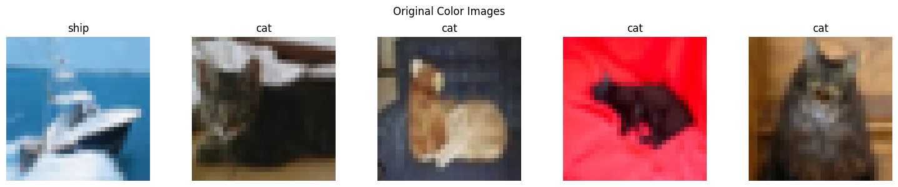
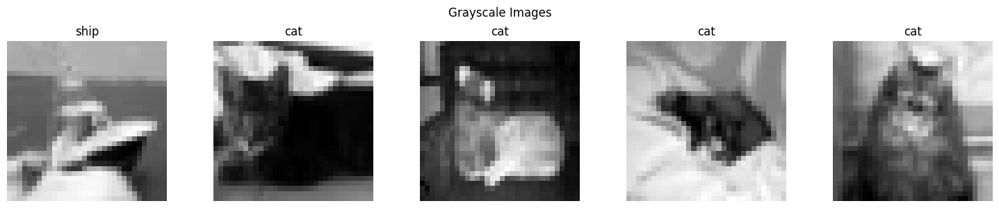
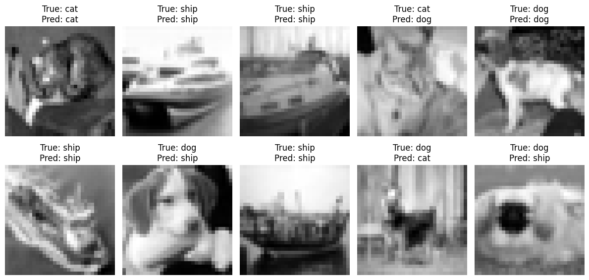
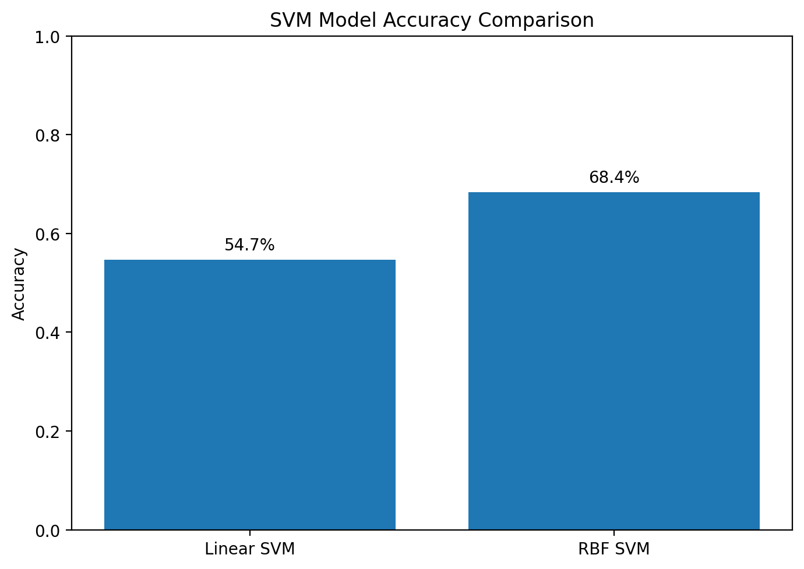

# Lab 03 – SVM Image Classification

## Overview

This lab used Support Vector Machines to classify images from the CIFAR-10 dataset. The selected classes were cats, dogs, and ships.

The images were converted into numerical features so the model could learn the differences between the classes. I tested different SVM kernels and compared their results.

## Models Used

- Linear Support Vector Machine
- RBF Support Vector Machine

## Model Evaluation

The models were evaluated using:

- Accuracy
- Precision
- Recall
- F1 score
- Classification report
- Confusion matrix

The results showed that changing the SVM kernel affected the model’s performance.

## Dataset

This lab used the CIFAR-10 dataset. CIFAR-10 is a public dataset containing small color images from ten different classes.

The dataset is loaded directly through the notebook and is not included in this repository.

## Technologies Used

- Python
- Scikit-learn
- NumPy
- Matplotlib
- Google Colab
- Jupyter Notebook

## How to Run

Open the notebook in Google Colab or Jupyter Notebook. Run the cells from top to bottom to load the dataset, train the models, and view the results.

## Sample Results

### Original CIFAR-10 Images

These are sample cat, dog, and ship images before preprocessing.

### Grayscale Images

These images show the selected CIFAR-10 classes after grayscale conversion.

### SVM Predictions

This result compares the predicted class with the correct class for several test images.

### Model Comparison

This chart compares the performance of the Linear SVM and RBF SVM models.
