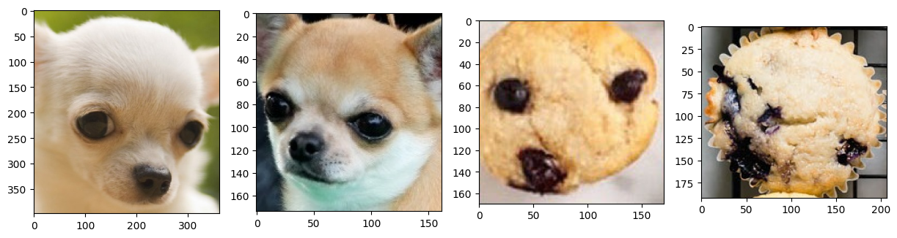
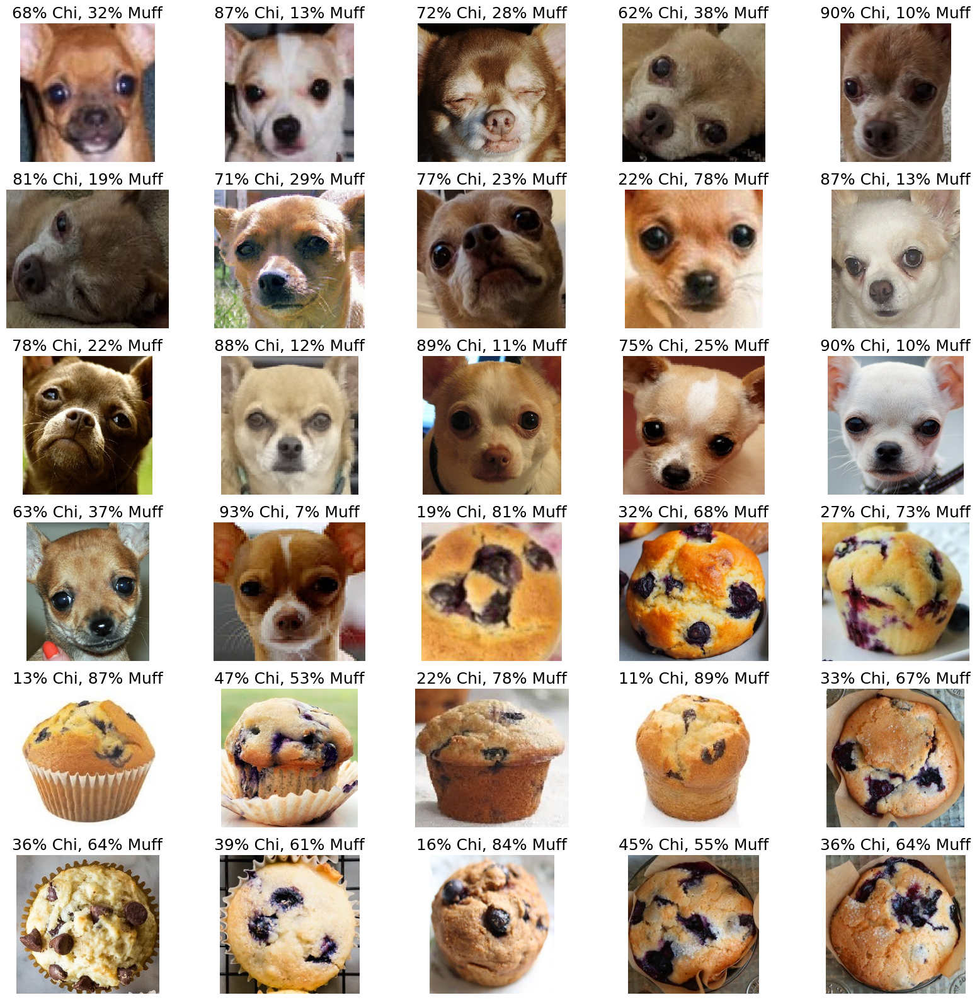

# Lab 04 – Chihuahua vs. Muffin Neural Network

## Overview

This lab used a neural network to classify images as either a Chihuahua or a muffin. These images can sometimes look similar because they may have similar colors, shapes, and textures.

I prepared the images, built the model, trained it, and tested its performance. I also changed settings such as the batch size, number of epochs, learning rate, and optimizer to see how they affected the results.

## Dataset

The dataset contains images of Chihuahuas and muffins. The images were divided into training and validation sets.

The dataset is not included in this repository because it is loaded or downloaded through the notebook.

## Model

The model used a neural network built with PyTorch. The images were resized, converted into tensors, and prepared before training.

The model was trained using different settings, including Adam and SGD optimizers.

## Results

The best model reached:

- **Best validation accuracy:** 96.67%
- **Task:** Binary image classification
- **Classes:** Chihuahua and Muffin

The results showed that changing the optimizer, batch size, and number of epochs affected the model’s performance.

## Technologies Used

- Python
- PyTorch
- Torchvision
- Pillow
- NumPy
- Matplotlib
- Google Colab
- Jupyter Notebook

## Skills Learned

- Image preprocessing
- Binary image classification
- Neural network development
- Training and validation
- Batch size and epochs
- Adam and SGD optimizers
- Accuracy and loss evaluation
- Overfitting analysis

## How to Run

Open the notebook in Google Colab or Jupyter Notebook. Run the cells from top to bottom to load the data, train the model, and view the results.

## Sample Results

### Sample Training Images

These are examples of Chihuahua and muffin images from the training dataset. The two classes can sometimes look similar because of their colors, shapes, and textures.

### Validation Predictions

This image shows the model’s predictions on the validation dataset. The percentages show how confident the model was that each image was a Chihuahua or a muffin.

The training and validation loss generally decreased over the 10 epochs. This shows that the model improved its predictions during training.
