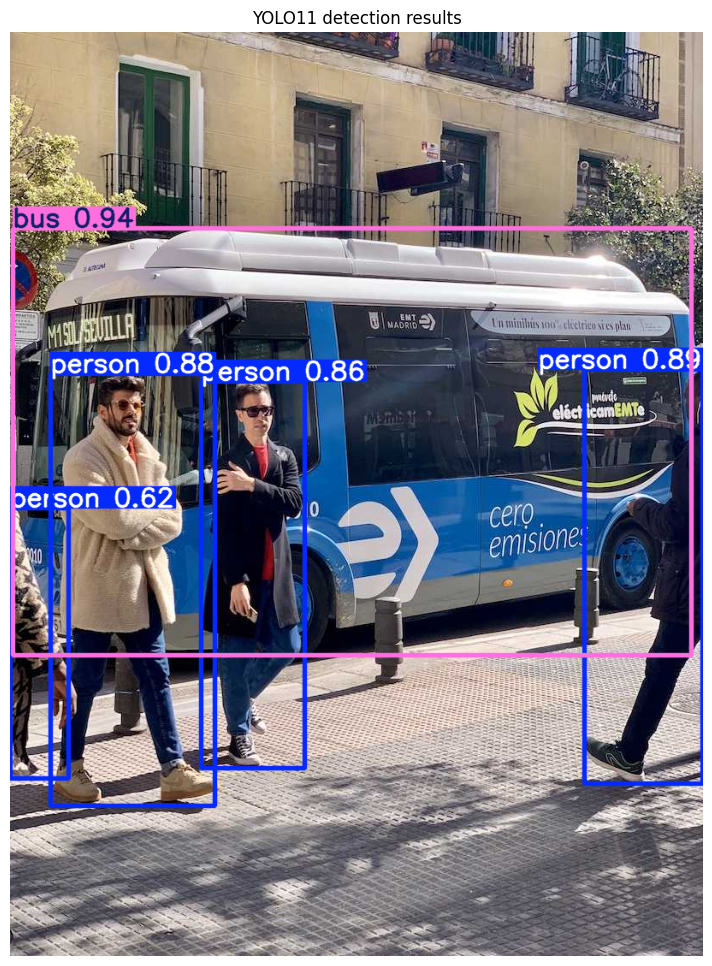
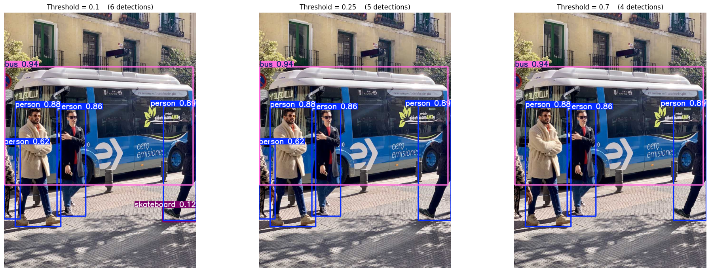
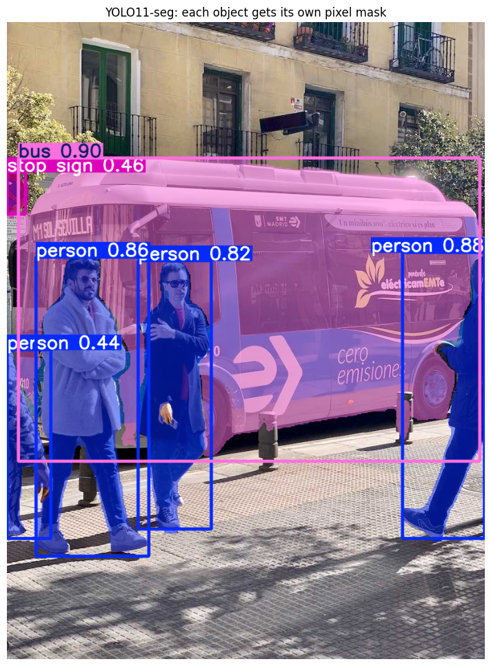
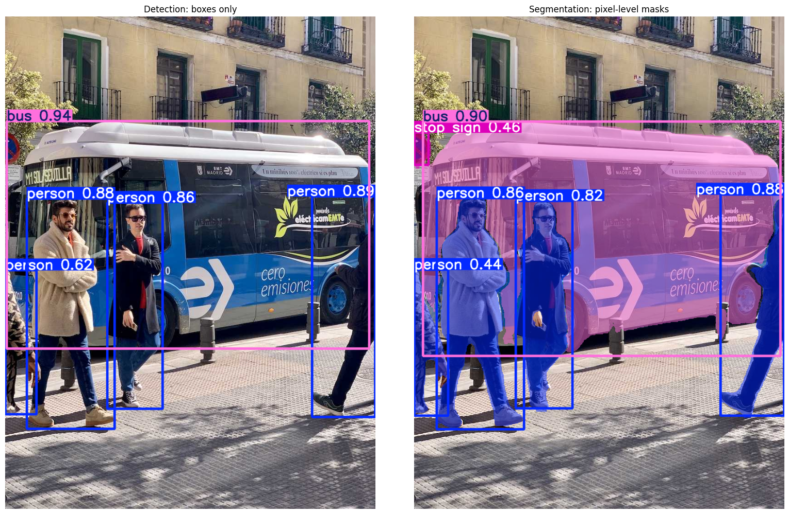
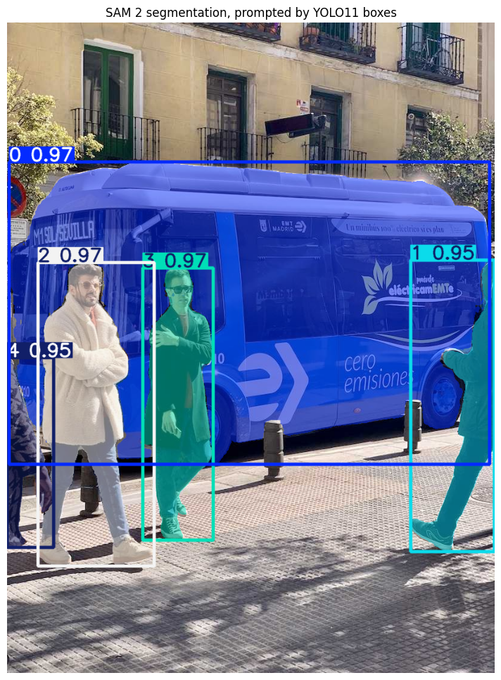
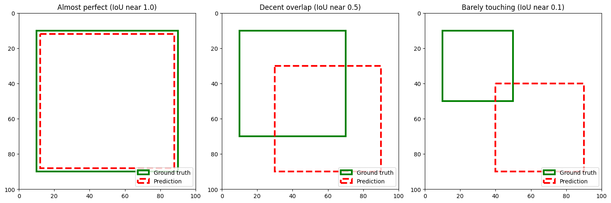

# Lab 06 – Object Detection and Image Segmentation

## Problem Statement

The purpose of this lab was to learn the difference between image classification, object detection, and image segmentation.

I used pretrained computer-vision models to locate objects with bounding boxes and create pixel-level masks around them.

## Approach

I used three models:

- YOLO11 for object detection
- YOLO11-seg for instance segmentation
- SAM 2 for detailed segmentation masks

I also tested different confidence thresholds to see how they affected the number of detections.

In the final activity, YOLO11 first detected the objects, and its bounding boxes were used as prompts for SAM 2.

## Dataset and Images

This lab did not use a training dataset because the models were already pretrained.

The notebook used public sample images from Ultralytics:

- `bus.jpg`
- `zidane.jpg`

The images and model files were downloaded automatically and were not uploaded separately.

[Ultralytics YOLO Documentation](https://docs.ultralytics.com/)

## Results

YOLO11 detected objects such as people, a bus, a stop sign, and a tie.

YOLO11-seg created separate masks for the detected objects. SAM 2 also created detailed masks after receiving bounding boxes from YOLO11.

The confidence-threshold test showed that lower thresholds keep more predictions, while higher thresholds keep only stronger predictions.

Since the models were pretrained, there was no training accuracy or loss curve to report.

## Key Findings

I learned that object detection shows the location of an object with a bounding box, while segmentation identifies the exact pixels belonging to the object.

I also learned that confidence thresholds create a tradeoff. A low threshold may include weaker predictions, while a high threshold may miss real objects.

YOLO can detect and label objects, while SAM 2 mainly creates masks from prompts.

## Technologies and Dependencies

- Python
- Ultralytics
- YOLO11
- YOLO11-seg
- SAM 2
- NumPy
- Pillow
- Matplotlib
- Google Colab
- Jupyter Notebook

The main library can be installed with:

```python
pip install ultralytics
```

## How to Run

1. Open `L06_Elham_Timory_ITAI1378.ipynb` in Google Colab.
2. Run the cells from top to bottom.
3. Allow the notebook to download the images and model files.
4. Review the detection, segmentation, confidence-threshold, and SAM 2 results.


## Sample Results

### YOLO11 Object Detection



This result shows bounding boxes, object labels, and confidence scores produced by YOLO11.

### Confidence Threshold Comparison



This comparison shows how changing the confidence threshold affects the number of accepted detections.

### YOLO11 Instance Segmentation



This image shows separate pixel-level masks for the detected objects.

### Detection and Segmentation Comparison



This comparison shows the difference between bounding-box detection and pixel-level segmentation.

### YOLO11 and SAM 2



This result shows the detect-then-segment workflow. YOLO11 first located the objects, and SAM 2 created detailed masks.

### Intersection over Union



This image shows how different levels of overlap affect the Intersection over Union score.

## Additional Result Files

- `detection-summary.txt` – Printed detection information from the notebook
