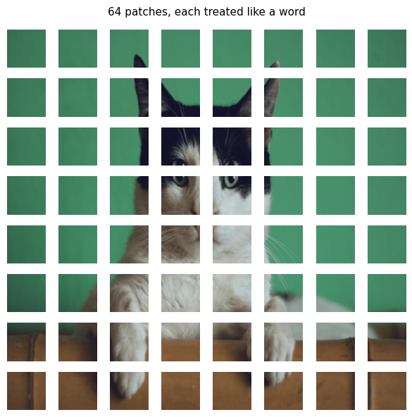
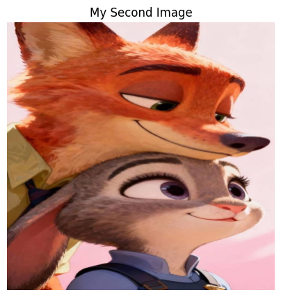
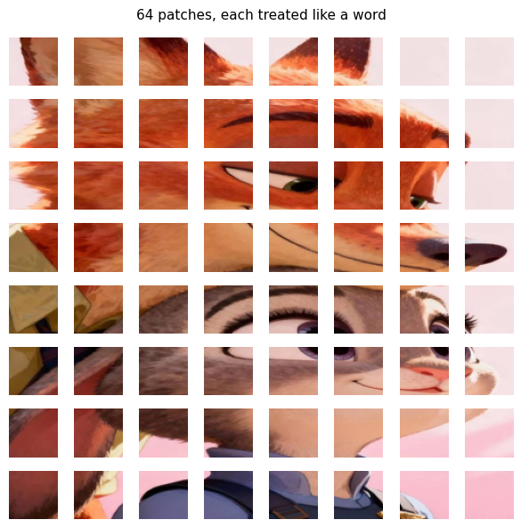
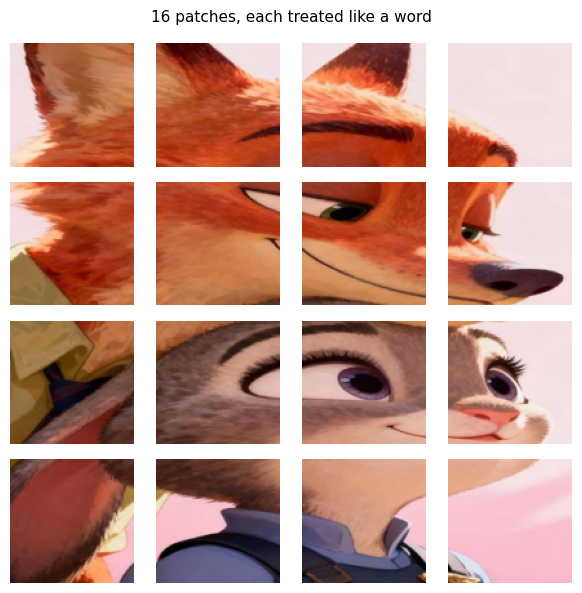
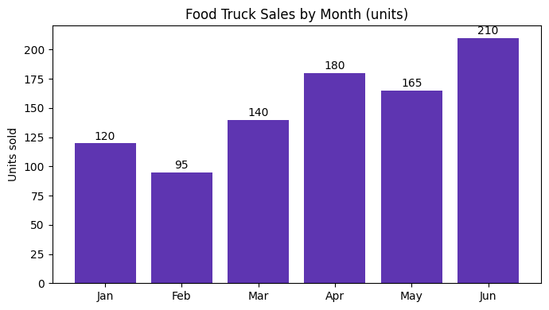

# Lab 08 - Vision Transformers and Vision-Language Models

## Overview
This lab introduced Vision Transformers and vision-language models. I learned how a Vision Transformer divides an image into smaller patches before processing it. 
I also used SmolVLM-500M-Instruct to ask questions about images, classify objects, count objects, count objects, create alt text, read a chart, and test for halluciantions.

## Model Used
The lab used SmolVLM-500M-Instruct. This model can process both images and written prompts.
The same model completed several tasks by changing the prompt instead of using a different model for every task. 

## Results

The 48-pixel patch grid divided the image into 64 smaller patches. This gave the model more visual detail.

The 96-pixel patch grid used only 16 larger patches. It required less processing, but it could miss smaller details.

The model answered two out of three chart questions correctly. It correctly identified the highest sales month and the March sales value, but it calculated the difference between June and February incorrectly.

During the hallucination test, the model correctly rejected three questions about objects that were not present. However, it answered “Jun” when asked about a digital clock that did not exist.

The deployment audit showed that the model could create useful alt text, but its answers were sometimes incomplete or inconsistent. I concluded that the model should be used with human review.

## Technologies Used

- Python
- PyTorch
- Hugging Face Transformers
- SmolVLM-500M-Instruct
- Pillow
- Matplotlib
- Google Colab
- Jupyter Notebook

## Skills Learned

- Vision Transformers
- Image patches
- Vision-language models
- Visual question answering
- Image classification
- Object counting
- Accessibility alt text
- Chart interpretation
- Prompt writing
- Hallucination testing
- Model evaluation

## How to Run

Open the notebook in Google Colab or Jupyter Notebook. Run the cells from top to bottom to load the model and complete the image tasks.

A GPU is recommended because the vision-language model requires more computing power than a basic image-processing notebook.

## Sample Results

### Cat Image Patch Grid

This image shows how a Vision Transformer divides a cat image into 64 smaller patches. Each patch acts like a visual word that helps the model understand the complete image.

### Original Second Image

This was the second image used to compare different patch sizes.

### 48-Pixel Patch Grid

The 48-pixel setting created 64 smaller patches. The smaller patches preserved more details from the image.

### 96-Pixel Patch Grid

The 96-pixel setting created 16 larger patches. This required less processing but provided fewer visual details.

### Chart-Reading Test

The model was asked three questions about this sales chart. It answered two questions correctly but gave the wrong answer when calculating the difference between June and February.

## Additional Results

The `vlm-evaluation-results.txt` file contains the printed results from the image interview, alt-text test, chart-reading questions, hallucination test, and deployment audit.
